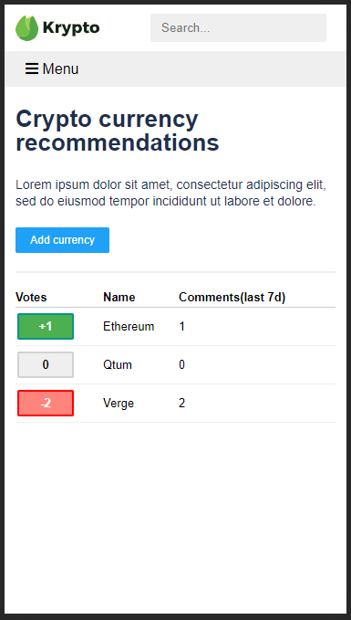
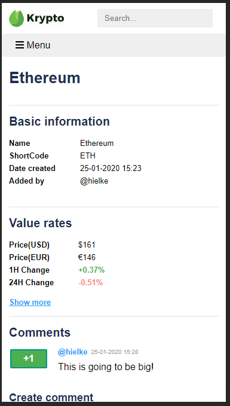
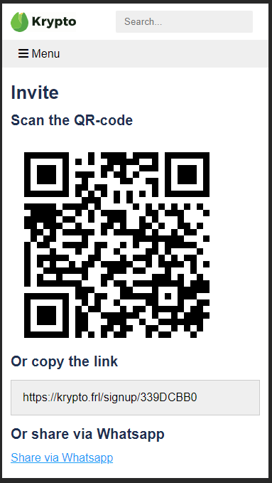
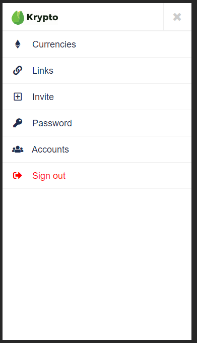

## Background
todo

## Screenshots

## Directories

    - database    Database table create queries
    - logo        Krypto logo files
    - screenshots Screenshots
    - src         Project source code 

## Development setup

### Requirements

#### Microsoft Visual Studio 2017

    https://www.visualstudio.com/thank-you-downloading-visual-studio/?sku=Community&rel=15
    
#### Microsoft MSSQL Server (Express)

    https://www.microsoft.com/nl-nl/sql-server/sql-server-editions-express

#### Microsoft MSSQL Server Management Studio

    https://docs.microsoft.com/en-us/sql/ssms/download-sql-server-management-studio-ssms

### Event logger

Add the event log source using PowerShell:

    PS> New-EventLog -LogName "Application" -Source "Krypto"
